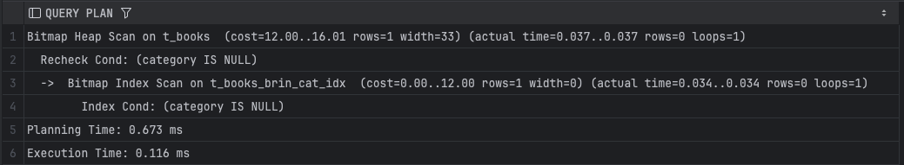
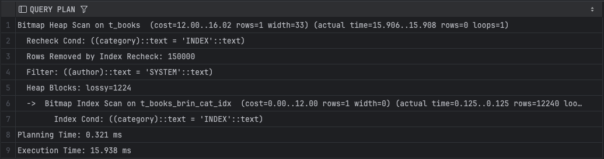
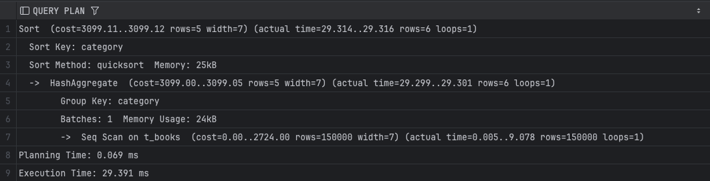
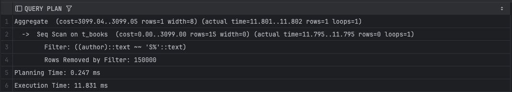
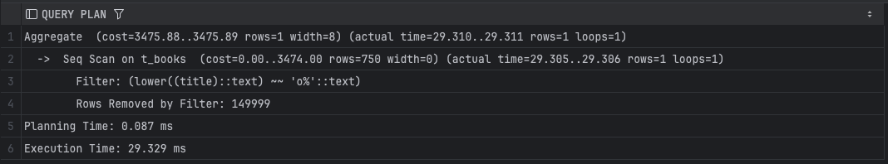
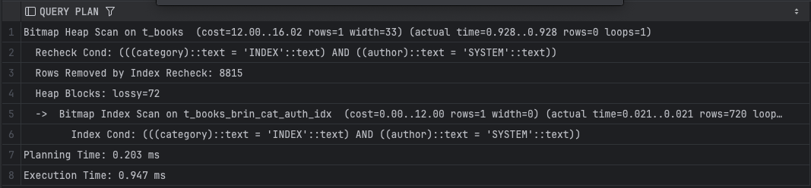

# Задание 1: BRIN индексы и bitmap-сканирование

1. Удалите старую базу данных, если есть:
   ```shell
   docker compose down
   ```

2. Поднимите базу данных из src/docker-compose.yml:
   ```shell
   docker compose down && docker compose up -d
   ```

3. Обновите статистику:
   ```sql
   ANALYZE t_books;
   ```

4. Создайте BRIN индекс по колонке category:
   ```sql
   CREATE INDEX t_books_brin_cat_idx ON t_books USING brin(category);
   ```

5. Найдите книги с NULL значением category:
   ```sql
   EXPLAIN ANALYZE
   SELECT * FROM t_books WHERE category IS NULL;
   ```
   
   *План выполнения:*

   
   *Объясните результат:*
   используется bitmap index scan по brin индексу t_books_brin_cat_idx. выполняется bitmap heap scan, где происходит перепроверка условия. в результате rows=0, при этом rows removed by index recheck = 150000. это показывает низкую точность brin индекса для поиска null и необходимость чтения большого числа heap блоков lossy=1224.

6. Создайте BRIN индекс по автору:
   ```sql
   CREATE INDEX t_books_brin_author_idx ON t_books USING brin(author);
   ```

7. Выполните поиск по категории и автору:
   ```sql
   EXPLAIN ANALYZE
   SELECT * FROM t_books 
   WHERE category = 'INDEX' AND author = 'SYSTEM';
   ```
   
   *План выполнения:*

   
   *Объясните результат (обратите внимание на bitmap scan):*
   используется bitmap index scan только по индексу на category. индекс возвращает 12240 строк, после чего bitmap heap scan выполняет фильтрацию по author. из результата удалено 150000 строк на этапе index recheck. фактическое время выполнения около 15.9 ms. это демонстрирует, что условие по author не участвует в индексном доступе и применяется только после чтения данных.

8. Получите список уникальных категорий:
   ```sql
   EXPLAIN ANALYZE
   SELECT DISTINCT category 
   FROM t_books 
   ORDER BY category;
   ```
   
   *План выполнения:*

   
   *Объясните результат:*
   planner выбирает seq scan по всей таблице с чтением 150000 строк. далее используется hashaggregate для получения уникальных значений категорий, фактически получено 6 строк. затем выполняется sort с использованием quicksort, память 25 kB. индекс не используется, так как требуется обработка всех строк и агрегирование.

9. Подсчитайте книги, где автор начинается на 'S':
   ```sql
   EXPLAIN ANALYZE
   SELECT COUNT(*) 
   FROM t_books 
   WHERE author LIKE 'S%';
   ```
   
   *План выполнения:*

   
   *Объясните результат:*
   выполняется seq scan по всей таблице. фильтр author like 's%' отбрасывает все 150000 строк, что отражено в rows removed by filter = 150000. индекс не используется, так как brin неэффективен для префиксного поиска, а подходящего btree индекса нет. общее время выполнения около 11.8 ms.

10. Создайте индекс для регистронезависимого поиска:
    ```sql
    CREATE INDEX t_books_lower_title_idx ON t_books(LOWER(title));
    ```

11. Подсчитайте книги, начинающиеся на 'O':
    ```sql
    EXPLAIN ANALYZE
    SELECT COUNT(*) 
    FROM t_books 
    WHERE LOWER(title) LIKE 'o%';
    ```
   
   *План выполнения:*

   
   *Объясните результат:*
   несмотря на наличие функционального индекса, planner использует seq scan. фактически прочитано 150000 строк, из них 149999 отброшены фильтром. результат содержит 1 строку. низкая селективность условия и стоимость случайного доступа делают последовательное сканирование дешевле, время выполнения около 29.3 ms.

12. Удалите созданные индексы:
    ```sql
    DROP INDEX t_books_brin_cat_idx;
    DROP INDEX t_books_brin_author_idx;
    DROP INDEX t_books_lower_title_idx;
    ```

13. Создайте составной BRIN индекс:
    ```sql
    CREATE INDEX t_books_brin_cat_auth_idx ON t_books 
    USING brin(category, author);
    ```

14. Повторите запрос из шага 7:
    ```sql
    EXPLAIN ANALYZE
    SELECT * FROM t_books 
    WHERE category = 'INDEX' AND author = 'SYSTEM';
    ```
   
   *План выполнения:*

   
   *Объясните результат:*
   используется bitmap index scan по составному brin индексу t_books_brin_cat_auth_idx. индекс сразу учитывает оба условия и возвращает 720 строк-кандидатов. при bitmap heap scan удалено только 8815 строк на этапе recheck, количество lossy блоков снижается до 72. фактическое время выполнения 0.947 ms, что на порядок быстрее, чем с одиночным индексом. это показывает преимущество составного brin индекса для коррелированных колонок.