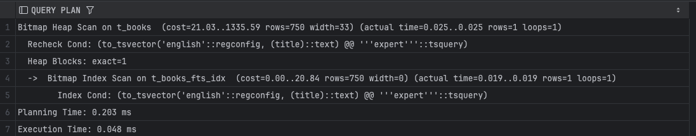
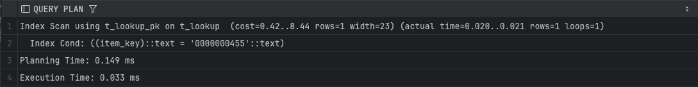
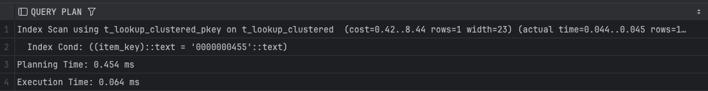
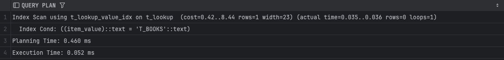
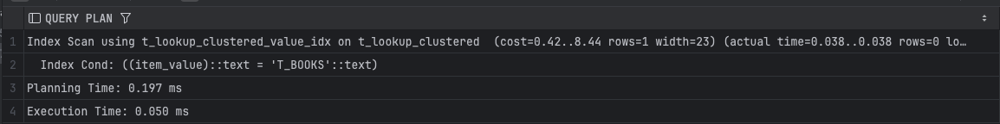

## Задание 2

1. Удалите старую базу данных, если есть:
    ```shell
    docker compose down
    ```

2. Поднимите базу данных из src/docker-compose.yml:
    ```shell
    docker compose down && docker compose up -d
    ```

3. Обновите статистику:
    ```sql
    ANALYZE t_books;
    ```

4. Создайте полнотекстовый индекс:
    ```sql
    CREATE INDEX t_books_fts_idx ON t_books 
    USING GIN (to_tsvector('english', title));
    ```

5. Найдите книги, содержащие слово 'expert':
    ```sql
    EXPLAIN ANALYZE
    SELECT * FROM t_books 
    WHERE to_tsvector('english', title) @@ to_tsquery('english', 'expert');
    ```
    
    *План выполнения:*

    
    *Объясните результат:*
     используется bitmap index scan по gin индексу t_books_fts_idx. индекс возвращает 1 строку-кандидат. далее выполняется bitmap heap scan с перепроверкой условия to_tsvector @@ to_tsquery. прочитан ровно 1 heap блок heap blocks: exact=1. общее время выполнения 0.048 ms, что показывает высокую эффективность gin индекса для полнотекстового поиска.

6. Удалите индекс:
    ```sql
    DROP INDEX t_books_fts_idx;
    ```

7. Создайте таблицу lookup:
    ```sql
    CREATE TABLE t_lookup (
         item_key VARCHAR(10) NOT NULL,
         item_value VARCHAR(100)
    );
    ```

8. Добавьте первичный ключ:
    ```sql
    ALTER TABLE t_lookup 
    ADD CONSTRAINT t_lookup_pk PRIMARY KEY (item_key);
    ```

9. Заполните данными:
    ```sql
    INSERT INTO t_lookup 
    SELECT 
         LPAD(CAST(generate_series(1, 150000) AS TEXT), 10, '0'),
         'Value_' || generate_series(1, 150000);
    ```

10. Создайте кластеризованную таблицу:
     ```sql
     CREATE TABLE t_lookup_clustered (
          item_key VARCHAR(10) PRIMARY KEY,
          item_value VARCHAR(100)
     );
     ```

11. Заполните её теми же данными:
     ```sql
     INSERT INTO t_lookup_clustered 
     SELECT * FROM t_lookup;
     
     CLUSTER t_lookup_clustered USING t_lookup_clustered_pkey;
     ```

12. Обновите статистику:
     ```sql
     ANALYZE t_lookup;
     ANALYZE t_lookup_clustered;
     ```

13. Выполните поиск по ключу в обычной таблице:
     ```sql
     EXPLAIN ANALYZE
     SELECT * FROM t_lookup WHERE item_key = '0000000455';
     ```
     
     *План выполнения:*

     
     *Объясните результат:*
     используется index scan по первичному ключу t_lookup_pk. условие по item_key полностью обслуживается индексом. возвращается 1 строка, heap читается точечно. фактическое время выполнения 0.033 ms. доступ к данным требует дополнительного обращения к heap, так как таблица не кластеризована.

14. Выполните поиск по ключу в кластеризованной таблице:
     ```sql
     EXPLAIN ANALYZE
     SELECT * FROM t_lookup_clustered WHERE item_key = '0000000455';
     ```
     
     *План выполнения:*

     
     *Объясните результат:*
     используется index scan по первичному ключу t_lookup_clustered_pkey. возвращается 1 строка. фактическое время выполнения 0.064 ms, что немного выше из-за большего planning time. кластеризация не дает выигрыша при точечном доступе по уникальному ключу.

15. Создайте индекс по значению для обычной таблицы:
     ```sql
     CREATE INDEX t_lookup_value_idx ON t_lookup(item_value);
     ```

16. Создайте индекс по значению для кластеризованной таблицы:
     ```sql
     CREATE INDEX t_lookup_clustered_value_idx 
     ON t_lookup_clustered(item_value);
     ```

17. Выполните поиск по значению в обычной таблице:
     ```sql
     EXPLAIN ANALYZE
     SELECT * FROM t_lookup WHERE item_value = 'T_BOOKS';
     ```
     
     *План выполнения:*

     
     *Объясните результат:*
     используется index scan по индексу t_lookup_value_idx. индекс возвращает 0 строк, так как значение T_BOOKS отсутствует. heap доступ фактически не выполняется. время выполнения 0.052 ms. результат определяется полностью на уровне индекса.

18. Выполните поиск по значению в кластеризованной таблице:
     ```sql
     EXPLAIN ANALYZE
     SELECT * FROM t_lookup_clustered WHERE item_value = 'T_BOOKS';
     ```
     
     *План выполнения:*

     
     *Объясните результат:*
     используется index scan по индексу t_lookup_clustered_value_idx. результат также пустой rows=0. время выполнения 0.050 ms. кластеризация не влияет на производительность, так как данные не читаются из heap.

19. Сравните производительность поиска по значению в обычной и кластеризованной таблицах:
     
     *Сравнение:*
     производительность поиска по значению в обычной и кластеризованной таблицах практически идентична. в обоих случаях используется index scan, возвращается 0 строк, heap не читается. кластеризация не дает преимущества, так как результат пустой и доступ ограничивается индексом.