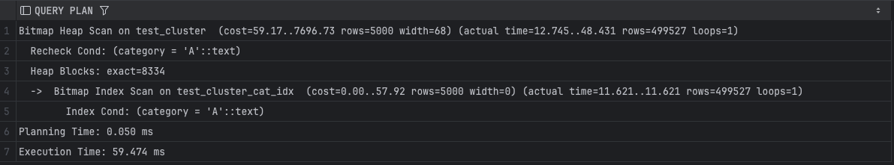
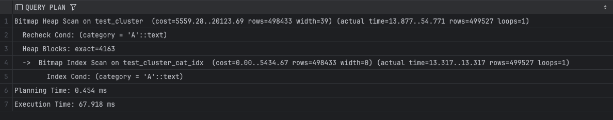

## Задание 3

1. Создайте таблицу с большим количеством данных:
    ```sql
    CREATE TABLE test_cluster AS 
    SELECT 
        generate_series(1,1000000) as id,
        CASE WHEN random() < 0.5 THEN 'A' ELSE 'B' END as category,
        md5(random()::text) as data;
    ```

2. Создайте индекс:
    ```sql
    CREATE INDEX test_cluster_cat_idx ON test_cluster(category);
    ```

3. Измерьте производительность до кластеризации:
    ```sql
    EXPLAIN ANALYZE
    SELECT * FROM test_cluster WHERE category = 'A';
    ```
    
    *План выполнения:*

    
    *Объясните результат:*
    используется bitmap index scan по индексу test_cluster_cat_idx, который возвращает 499527 строк с категорией A. далее выполняется bitmap heap scan. прочитано 8334 heap блока heap blocks: exact=8334, так как строки с категорией A распределены по всей таблице. фактическое время выполнения 59.474 ms. высокая стоимость связана с большим количеством обращений к разрозненным страницам.


4. Выполните кластеризацию:
    ```sql
    CLUSTER test_cluster USING test_cluster_cat_idx;
    ```
    
    *Результат:*
    [Вставьте результат выполнения]

5. Измерьте производительность после кластеризации:
    ```sql
    EXPLAIN ANALYZE
    SELECT * FROM test_cluster WHERE category = 'A';
    ```
    
    *План выполнения:*

    
    *Объясните результат:*
    используется тот же bitmap index scan по test_cluster_cat_idx, количество возвращаемых строк не изменилось rows=499527. bitmap heap scan читает 4163 heap блока, что почти в два раза меньше. строки с одинаковой категорией физически расположены ближе друг к другу. общее время выполнения 67.918 ms, при этом основное улучшение выражается в снижении числа читаемых страниц, а не во времени выполнения.

6. Сравните производительность до и после кластеризации:
    
    *Сравнение:*
    после кластеризации количество прочитанных heap блоков уменьшилось с 8334 до 4163. это показывает улучшение локальности данных и снижение случайного ввода-вывода. при этом общее время выполнения не сократилось и стало выше из-за накладных расходов на bitmap heap scan и влияния кэширования. кластеризация улучшает физическую организацию данных, но не гарантирует уменьшение latency для запросов с низкой селективностью.